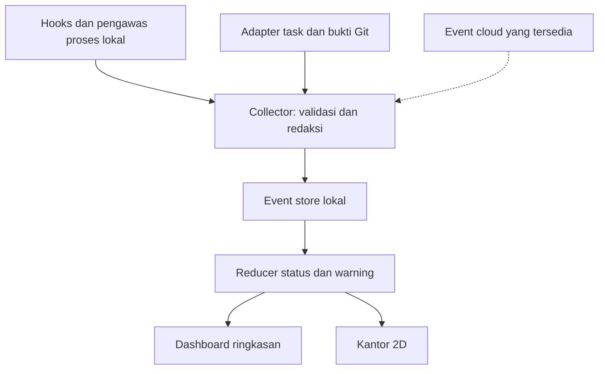

# HANDOFF — MAXI Agent Monitor & Virtual Office

**Status:** MVP v0.1 telah diimplementasikan di branch PR #466; integrasi laptop/Claude Code nyata belum diverifikasi. Desain v2 tetap menjadi target, dengan batas MVP di bagian hasil implementasi.
**Requested by:** Bos Cyo.
**Prepared/revised by:** Karen (ChatGPT), atas permintaan langsung Bos Cyo.
**Date:** 2026-10-08.
**Repository:** cyo-ramadan/prototype-leker.
**Scope sesi:** membaca, mengevaluasi, mematangkan, dan mendokumentasikan desain sebelum coding.
**Aturan pembacaan:** desain v2 di bawah menggantikan rekomendasi v1 yang bertentangan. Brief asli dipertahankan di lampiran sebagai provenance, bukan kontrak aktif.

## Hasil implementasi Karen — 2026-10-08

Instruksi lanjutan Bos Cyo: “ya uda rancang aja dan buatin langsung”. Karen (`karen22.1`) membangun tooling lokal terisolasi di `tools/agent-office/`, tanpa mengubah source POS, migration, atau deploy config.

- Dibuat: kantor Canvas 2D, demo offline `preview.html`, kartu/timeline, karakter editable, collector HTTP/SSE, SQLite lokal, hooks Claude Code, installer/uninstaller aditif, serta process wrapper.
- Gerakan tersedia: kerja di laptop, idle ke pantry, event task sukses ke papan, menunggu approval, telemetry terputus.
- Bukti: 1.631 tes root lulus (termasuk 11 tes tooling); root check dan check tooling lulus. Browser Chromium: desktop + 390px mobile, edit profil, mode hemat, HTTP/SSE dua sesi fixture, disconnect, dan file preview offline lulus tanpa page error atau horizontal overflow.
- Batas: belum diuji dengan sesi Claude Code nyata/Windows/laptop Bos Cyo. Workboard/Agent Bus/GitHub live adapter, collision warning, external sprite upload, dan benchmark 30 menit belum dibuat/dijalankan. Fixture bukan bukti dua agent AI sungguhan.
- Rencana memakai sprite atlas diperbarui untuk MVP: karakter/furnitur procedural Canvas, tanpa asset network atau dependency runtime. Node memakai SQLite bawaan (minimum 22.13).
- Producer v0.1 best-effort, tanpa durable retry queue; event saat collector mati bisa hilang. Freshness tetap terlihat, tidak direkonstruksi.
- Panduan install, batas akses, dan uninstall: `tools/agent-office/README.md`. Bukti rinci: `tools/agent-office/IMPLEMENTATION.md`.
- Koordinasi: sesi terdaftar; konektor tidak menyediakan create task. Tidak membuat klaim/report papan fiktif; jalur GitHub-only sesuai CLAIM-PROMPT.

Bagian desain di bawah mencatat target semula; pernyataan “belum implementasi” di histori desain/arsip dibaca sebagai keadaan saat desain ditulis, bukan status MVP terkini.

## 1. Keputusan desain dan koreksi utama

Bos Cyo perlu tahu siapa bekerja, sedang mengerjakan apa, siapa membutuhkan tindakan, dan apakah perubahan berpotensi bentrok. Rekomendasi Karen: monitor lokal berbasis event dengan status yang bisa ditelusuri buktinya, dilengkapi tampilan kantor 2D.

Kelemahan brief awal:
- GitHub adalah sumber kode dan histori, bukan sumber kebenaran aktivitas proses realtime.
- Heartbeat yang hilang menunjukkan visibility hilang; belum membuktikan agent crash.
- Proses keluar normal atau dibatalkan pengguna tidak boleh dilabeli crash.
- Tidak ada aktivitas bisa berarti thinking, menunggu jaringan, tool lama, atau menunggu pengguna.
- Claude Web dan terminal punya akses telemetry berbeda. Jangan menjanjikan observasi internal browser/cloud.
- Nama kandidat awal tidak dilengkapi repo/version terverifikasi; tidak boleh langsung dijadikan dependency.
- Crash proses, kegagalan tool, konflik Git, serta task selesai adalah empat hal berbeda.

Keputusan:
1. Pisahkan task status, runtime status, dan telemetry health.
2. Setiap kartu punya sumber bukti, waktu terakhir terlihat, dan tingkat observasi.
3. Gunakan program deterministik untuk event/heartbeat/rules; nol panggilan model rutin adalah target desain. Proses coding/analisis dengan AI tetap memakai kuota AI.
4. Monitor tidak melakukan auto-merge, auto-pull, kill/restart agent, menjalankan shell dari dashboard, atau menyelesaikan task di Agent Bus.
5. Lokal dulu, sebagai tooling terpisah dari aplikasi POS dan database transaksi.

## 2. Pengalaman Bos Cyo

Dua tab memakai data status yang sama:

**Ringkasan:** jumlah sesi terpantau, butuh respons, potensi bentrok, serta koneksi yang hilang. Kartu diurutkan berdasarkan tindakan yang dibutuhkan. Satu agent bisa punya beberapa sesi; nama tampilan tidak menjadi primary key.

Isi kartu:
- Nama/sesi, platform, task dan project.
- Aktivitas terakhir: membaca, mengedit, menjalankan tes, menunggu respons.
- Repo, branch, file relatif bila benar-benar tersedia.
- Last seen, bukti status, sumber, dan label OBSERVED / REPORTED / INFERRED / UNAVAILABLE.
- Klik kartu membuka timeline dan link task/PR yang telah terverifikasi.

**Kantor 2D:** avatar per sesi, meja per project, balon status, klik menuju kartu yang sama. Status tidak diturunkan dari animasi. Koneksi hilang membuat avatar redup dan bertanda “data terputus”; animasi mengetik berhenti. Tampilan tetap bisa dipahami tanpa warna atau suara. Sediakan reduced motion.

Contoh tampilan ini spesifikasi, bukan data live:
- Hana · sesi A · menjalankan tes · OBSERVED · 4 detik lalu.
- Karen · sesi B · task diklaim · REPORTED · 8 menit lalu · aktivitas internal tidak tersedia.
- Zee · sesi C · UNAVAILABLE · belum ada sumber telemetry.

Tidak ada progress persen, estimasi token, atau klaim “selesai” hasil tebakan.


## 2A. Arahan visual Bos Cyo — 2026-10-08

Bos Cyo memberi referensi gambar kantor dengan sudut atas miring, meja kerja, area meeting, dan karakter kecil; meminta versi lebih bagus dan paling ringan. Bos Cyo akan menentukan roster agent serta karakter/pet belakangan. Arahan ini menjadi kebutuhan inti visual, bukan bonus opsional. “Pet” di sini karakter di kantor aplikasi; bukan otomatis ChatGPT Work Pet.

**Keputusan Karen:** kantor 2D isometrik memakai Canvas 2D dan sprite atlas; tidak memakai engine 3D, video background, atau simulasi fisika. Layer lantai/furnitur dirender sekali dan dipakai ulang. UI kartu/detail tetap HTML agar teks jelas dan mudah diakses. Area visual: meja laptop, kantin/pantry, papan task, ruang meeting, dan area istirahat. Meeting baru dianimasikan sebagai kolaborasi nyata bila ada event yang membuktikannya; tidak mengarang rapat.

| Keadaan/event | Perilaku karakter | Makna yang ditampilkan |
|---|---|---|
| Idle terkonfirmasi | Setelah jeda 20–40 detik boleh ke kantin, duduk, atau istirahat | Dekorasi idle; tidak berarti agent sungguhan makan |
| Job/tool mulai | Prioritas tertinggi: hentikan idle dan pindah menuju meja laptop | Label WORKING berubah segera; animasi tidak menunda data |
| Penulisan task teramati berhasil | Pergi ke papan, tampilkan ikon catatan | Hanya jika ada bukti event create/update task; tidak dipicu sekadar nama tool yang ambigu |
| Menulis task gagal | Ikon gagal pada kartu/timeline | Tidak menempel task sukses di papan |
| Menunggu approval/user | Tetap dekat meja dengan balon permintaan | Balon dapat diklik untuk detail; tidak menyetujui otomatis |
| Turn selesai, sesi masih hidup | Berhenti mengetik; kemudian kembali idle | Tidak menyimpulkan task DONE |
| Task selesai berdasarkan status canonical | Animasi singkat selesai, lalu idle bila runtime juga idle | Status task dan runtime tetap terpisah |
| Data hilang/crash | Hentikan animasi kerja, redup/indikator sesuai bukti | Tidak berjalan ke kantin seolah idle |

Aturan konflik animasi: telemetry hilang/crash dan kebutuhan perhatian mengalahkan dekorasi; aktivitas kerja terbaru membatalkan jalan-jalan. Event create/update task yang terjadi saat tool lain masih aktif cukup memunculkan ikon papan, tidak memaksa karakter bolak-balik. Perjalanan maksimal sekitar 1 detik, rute grid sederhana dihitung hanya saat tujuan berubah; hindari collision simulation. Tidak ada event penting yang ditahan menunggu animasi selesai. “Berjalan” dan “makan” selalu ilustrasi status, bukan telemetry tindakan fisik.

Arah art: satu ruangan dengan zona jelas, furnitur proporsional, warna hangat netral dengan aksen warna tiap agent, garis rapi, label terbaca, minim clutter. Efek bayangan statis; hindari glow/partikel terus-menerus. Pada HP tampilkan ringkasan/kartu dulu dengan office opsional; zoom/pan hanya jika dibutuhkan.

Budget visual usulan, belum benchmark:
- 30 FPS maksimum saat karakter bergerak, turun 10–15 FPS saat idle; requestAnimationFrame dijeda saat tab tersembunyi dan render on-demand saat tidak ada perubahan.
- Maksimum awal 12 karakter bergerak; sisanya tetap ada di daftar dan menjadi sprite statis bila perlu. Jangan menghilangkan sesi dari hitungan.
- Sprite atlas terkompresi total target <= 1 MB, initial transfer tampilan <= 2 MB terkompresi; target resource gabungan mengikuti §8.
- Batasi device pixel ratio maksimum 1.5–2 setelah uji keterbacaan; sediakan mode hemat dengan semua animasi off.
- Jika kandidat Pixel Agents melampaui budget atau sulit mengikuti state canonical, pilih renderer Canvas sederhana. Tidak perlu mempertahankan dependency demi tampilan referensi.

**Roster dan karakter:** schema konfigurasi berisi agent_id, display_name, role_label, sprite_id, warna aksen, meja pilihan, dan optional companion_sprite_id. Nama, karakter, serta jumlah belum diputuskan; gunakan placeholder berlabel saat prototype. Asset dipisahkan dari identity/session dan bisa diganti tanpa coding ulang. Gunakan asset berlisensi sesuai atau gambar buatan khusus; sprite final menunggu arahan Bos Cyo. Image generation bisa dipakai nanti untuk desain karakter, lalu export atlas teroptimasi; tidak memanggil image/model API saat aplikasi berjalan.

Kriteria tambahan: perubahan status kerja langsung terlihat walau avatar di kantin; event task sukses/gagal tidak tertukar; tab tersembunyi tidak menjalankan loop animasi aktif; mode hemat menampilkan informasi yang sama; agent disconnected tidak tampak bekerja; 12 karakter diuji dengan profiling perangkat nyata.

## 3. Batas sumber data

| Sumber | Bisa diandalkan untuk | Batas |
|---|---|---|
| Claude Code lokal dengan hooks teruji | Lifecycle/tool events yang benar-benar dikirim | Event tersedia bergantung versi; Stop adalah akhir turn, bukan task selesai |
| Pengawas proses lokal | PID + waktu mulai, keluar proses, status collector | Proses hidup tidak membuktikan agent membuat progress |
| Codex/CLI lain | Exit lifecycle dari wrapper; adapter resmi setelah diuji | Dukungan event detail belum diverifikasi pada laptop Bos Cyo |
| Claude Web / sesi ChatGPT cloud | Event connector/task yang benar-benar tercatat | Tidak melihat thinking, proses internal, crash, atau heartbeat cloud tanpa dukungan runtime |
| MAXI Agent Bus | Identitas, task, claim, reserved paths, report | Claim aktif tidak membuktikan agent masih hidup; REPORTED tidak sama dengan VERIFIED/DONE |
| GitHub/Git lokal | Branch, commit SHA, PR/CI serta working tree lokal yang diizinkan | Tidak ada commit tidak berarti agent idle; kondisi remote hanya benar saat terakhir diperbarui |

Identitas: agent_id + session_id + device_id + process_start_time; simpan native_session_id untuk korelasi. Mapping ke sesi Agent Bus eksplisit; jangan mencocokkan hanya dari nama “Karen”.

## 4. Arsitektur target



Usulan stack MVP: Node.js 22 LTS, SQLite lokal dengan driver yang dipin setelah compatibility check, HTTP lokal + SSE untuk dashboard, HTML/CSS/JS ringan. Polling jaringan ke POS/Agent Bus tidak diperkenalkan. Heartbeat lokal collector dan pemeriksaan proses merupakan mekanisme tooling terpisah; integrasi push ke MAXI kelak harus melewati impact assessment.

Collector mencatat metadata allowlist, lalu reducer menghasilkan snapshot. Dashboard mengambil snapshot awal dan berlangganan SSE dengan reconnect/replay. Kehilangan sambungan dashboard ditampilkan tersendiri.

Penyimpanan di luar repo. Batas awal usulan: history 7 hari, maksimum 100 MB, event maksimum 8 KB; pruning dan jumlah event yang dibuang terlihat. Angka ini target awal, belum hasil benchmark.

### Kontrak event minimum

schema_version, event_id, producer_id, producer_seq, agent_id, session_id, device_id, source, evidence_level, event_type, occurred_at, received_at, project, repository, branch, task_id, tool_name, relative_file, outcome, sanitized_error_code.

- Nullable berarti tidak tersedia, bukan nol.
- Dedup berdasarkan event_id; urutan producer_seq per producer/session.
- Event terlambat disimpan untuk history tetapi tidak mengembalikan status sesi yang sudah lebih baru.
- Jangan membandingkan urutan waktu antar-device hanya dengan jam client.
- Gunakan waktu penerimaan dan timer monoton untuk timeout; deteksi sleep/resume laptop.
- Queue pengiriman dibatasi, retry dengan backoff, tanpa memperlambat tool agent; collector gagal tidak memblokir kerja agent.
- Event tidak boleh berisi prompt, jawaban, isi source code, command arguments, env vars, cookie, token, atau tool output mentah secara default.

## 5. Aturan status yang dapat diuji

Pisahkan tiga field:
- runtime: UNKNOWN, IDLE, WORKING, WAITING_USER, WAITING_APPROVAL, EXITED, CRASHED.
- telemetry: CONNECTED, STALE, DISCONNECTED, UNSUPPORTED.
- task: status asli dari sumber task; tidak disimpulkan dari runtime.

| Bukti | Tampilan |
|---|---|
| Tool mulai/aktivitas agent teramati | WORKING + nama aktivitas |
| PermissionRequest yang belum terselesaikan | WAITING_APPROVAL |
| Akhir turn, proses masih hidup | IDLE / menunggu input; task tetap sesuai papan |
| Tool gagal | Tool error pada timeline; agent bisa tetap WORKING |
| Exit normal atau cancel yang diketahui | EXITED + alasan |
| Pengawas menangkap terminasi abnormal sesi yang sebelumnya hidup | CRASHED + bukti exit/signal |
| PID hilang tanpa bukti sebab | EXITED/UNKNOWN, alasan belum diketahui |
| Collector heartbeat hilang | STALE/DISCONNECTED; runtime sebelumnya diberi label stale |
| Aktivitas lama tidak berubah, proses masih terpantau | Warning POSSIBLY_STALLED, bukan vonis |
| Tidak ada sumber untuk web agent | UNSUPPORTED/UNAVAILABLE |

Default usulan: heartbeat collector 15 detik, STALE setelah 45 detik, DISCONNECTED setelah 90 detik. Angka disetel ulang setelah tes Windows/sleep. Heartbeat collector tidak boleh ditampilkan sebagai heartbeat agent.

Warning POSSIBLY_STALLED awal setelah 10 menit tanpa progress yang teramati, hanya jika task aktif dan proses terpantau. Waiting approval/user, idle, serta tool dengan timeout lebih panjang dikecualikan. Beri aksi dismiss/snooze pada warning lokal; tidak mengubah task asli.

## 6. Potensi bentrok dan sinkronisasi Git

- Dua task aktif dengan reserved path overlap: warning “potensi bentrok”.
- Dua worktree yang mengubah path sama: tambahan bukti; belum tentu merge conflict.
- Branch tertinggal: laporkan hanya terhadap remote ref yang sudah di-fetch, tampilkan waktu fetch.
- Tanpa working tree lokal, tampilkan coverage terbatas.
- Pembuktian merge conflict membutuhkan analisis merge terisolasi; di luar MVP.
- Monitor tidak menulis atau melakukan pull ke working tree aktif.
- Setiap agent/task memakai branch/worktree terpisah. Monitor membantu visibilitas; mekanisme claim canonical tetap mengatur hak kerja.
- GitHub menyimpan source; Agent Bus menyimpan koordinasi; event store lokal menyimpan observasi runtime.

## 7. Pilihan tool, plugin, connector, dan skill

| Komponen | Keputusan Karen | Alasan / gate |
|---|---|---|
| GitHub connector yang tersedia | Pakai untuk dokumen/repo/task evidence sesuai akses | Tidak perlu connector kedua |
| MAXI Agent Bus yang tersedia | Pakai kemampuan baca yang sudah ada | Tidak menganggap tersedia heartbeat/event API baru |
| Collector lokal | Diperlukan saat implementasi | Menjembatani aktivitas terminal dan status proses |
| Pixel Agents | Kandidat utama visual 2D, spike terisolasi dulu | Integrasi Claude Code disebut tersedia; Codex masih roadmap dalam README saat diperiksa |
| Dashboard MAXI sederhana | Baseline otoritatif MVP | Status dan coverage bisa mengikuti kontrak sendiri |
| Datadog | Tidak dipilih untuk MVP | Discovery menemukan plugin, tetapi kebutuhan awal lokal sederhana |
| n8n / model API / AI supervisor | Tidak diperlukan untuk MVP | Tidak diperlukan untuk rules/event deterministik |
| Graphify | Nanti saat mencari titik integrasi kode MAXI | Peta kode tidak memberi status runtime |
| Skill SOP monitoring | Dokumentasikan setelah adapter stabil | Skill mengatur pelaporan; bukan daemon background |
| Playwright atau browser test | Verifikasi UI pada implementasi | Validasi status, reconnect, reduced motion |

Pixel Agents menyediakan mode standalone dan extension. Rekomendasi spike: local-only, terminal terintegrasi dinonaktifkan, dependency dipin. Jangan menganggap pilihan tersebut otomatis menghilangkan seluruh kemampuan kontrol; audit route dan akses sebelum dipakai sebagai viewer. Jika adaptor visual tidak cocok dengan kontrak MAXI atau perlu fork besar, lanjutkan dashboard baseline dan buat office sederhana dari snapshot yang sama.

Kandidat tanpa identitas/version jelas pada brief v1 tetap berstatus belum terverifikasi; tidak masuk dependency.

Untuk Claude hooks, pilih command handler deterministik yang hanya mengirim metadata, tanpa prompt/agent hook berbasis model dan tanpa output yang memodifikasi permission/tool. Pertahankan hooks existing, pasang secara aditif, sediakan rollback.

Skill yang dipakai pada sesi desain: Library untuk pencarian awal, Plugin Management untuk discovery kebutuhan koneksi. Tidak ada plugin baru yang diinstal.


## 7A. Mesin agent, model alternatif, dan handoff Hana

Arahan terakhir Bos Cyo: Karen tetap menjadi pelaksana selama mampu mengerjakan. Handoff ke Hana hanya bila ada ketidakcocokan kemampuan atau akses yang benar-benar terbukti, bukan otomatis karena integrasi acuannya Claude Code. Karen dapat merancang dan mengimplementasikan adapter; verifikasi sesi nyata di laptop membutuhkan akses ke runtime tersebut. Bos Cyo juga ingin kemungkinan memakai mesin Claude Code dengan model lain seperti DeepSeek. Belum men-trigger Hana atau memasang konfigurasi.

Pisahkan tiga identitas:
- persona/agent: nama yang nanti ditentukan Bos Cyo;
- harness: Claude Code / OpenCode / CLI lain;
- provider + model: Anthropic/Claude, DeepSeek/model yang tersedia, dll.

Tambahkan harness_name, harness_version, configured_provider, configured_model, observed_model (nullable), model_evidence_source pada session metadata. Model yang dikonfigurasi tidak selalu sama dengan model yang benar-benar merespons; bila ada mapping provider, tampilkan asal buktinya.

Riset 2026-10-08:
- DeepSeek mendokumentasikan penggunaan Claude Code melalui endpoint berformat Anthropic: https://api.deepseek.com/anthropic . Setup mengarahkan base URL, credential DeepSeek dan model mapping. Sumber: https://api-docs.deepseek.com/quick_start/agent_integrations/claude_code/ .
- Anthropic menyatakan routing Claude Code ke model non-Claude melalui gateway tidak didukung oleh Anthropic. Karena itu “tersedia panduan dari DeepSeek” tidak sama dengan jaminan seluruh fitur Claude Code kompatibel. Sumber: https://code.claude.com/docs/en/llm-gateway .
- OpenCode adalah alternatif harness multi-provider dan mendokumentasikan DeepSeek; bukan komponen wajib untuk memakai DeepSeek pada Claude Code. Sumber: https://opencode.ai/docs/providers/ .

Rekomendasi Karen: pertahankan Hana/Claude Code + Claude sebagai baseline. Uji profil Claude Code + DeepSeek terpisah jika Bos Cyo ingin mempertahankan mesin Claude Code. Untuk sering berpindah banyak provider, pertimbangkan OpenCode pada tahap adapter berikutnya. Tidak menimpa konfigurasi global Hana dan tidak membuat fallback diam-diam ke provider berbayar lain.

Checklist implementasi Karen; handoff parsial kepada Hana hanya untuk langkah yang terbukti tidak dapat dijalankan Karen:
1. Verifikasi CLI/OS yang benar-benar digunakan, capabilities hooks, dan file konfigurasi existing.
2. Uji baseline dua sesi dan telemetry sebelum mengganti model.
3. Buat profil terminal terisolasi untuk DeepSeek bila dipilih; credential dimasukkan melalui jalur lokal aman, tidak lewat chat/repo.
4. Uji tool calls baca/edit/test, streaming, permission wait, context compaction dan subagent jika dipakai, cancellation, serta model/provider yang benar-benar melayani request.
5. Buktikan hooks monitor tetap berfungsi pada profil alternatif. Ini hipotesis karena harness sama, belum hasil uji.
6. Catat biaya API provider terpisah dari langganan chat; jangan menganggap langganan chat mencakup API DeepSeek.
7. Jika menggunakan OpenCode, implementasikan adapter event khusus; jangan menganggap dukungan Pixel Agents otomatis tersedia.
8. Laporkan kompatibilitas per fitur, batasan, version pin dan rollback, tanpa klaim kesetaraan kecerdasan/performa antar-model.

## 8. Security, biaya, dan operasional

- Bind 127.0.0.1; tidak membuka dashboard ke internet/LAN secara default.
- Auth event producer dan allowlist Origin/Host; jangan mengandalkan localhost sebagai satu-satunya proteksi.
- Secret lokal di tempat credential OS yang sesuai; tidak masuk repo, URL yang dibagikan, atau log.
- Akun dashboard hanya baca telemetry. Tidak membawa GitHub write token, credential deploy, atau token DB produksi.
- Task titles, paths, dan errors diperlakukan sebagai data tidak tepercaya, di-escape pada UI.
- Pembacaan transcript mentah opsional dan scoped ke workspace/sesi yang dipilih, bukan menyapu seluruh laptop.
- Target rutin monitoring tanpa panggilan LLM; tetap ada penggunaan CPU, RAM, disk dan jaringan bila sumber remote dipakai.
- Target benchmark awal: dua sesi selama 30 menit, p95 render event di bawah 2 detik; proses monitor rata-rata di bawah 5% total CPU dan gabungan RAM di bawah 250 MB. Ukur dan laporkan perangkat; jangan klaim tercapai sebelum tes.
- Monitoring lokal berhenti saat laptop mati/tidur; setelah resume tampilkan gap, bukan crash massal.
- Akses HP atau cloud collector merupakan tahap lanjutan dengan autentikasi dan impact assessment terpisah.

## 9. Rencana pelaksanaan setelah desain

1. Inventory nyata di laptop: OS, versi Node/CLI, terminal vs WSL, lokasi repo/worktree, hooks existing, event yang tersedia. Sesi cloud ini belum mengakses laptop Bos Cyo.
2. Spike isolated dua sesi Claude Code; rekam event nyata yang sudah disanitasi. Evaluasi Pixel Agents dengan versi dipin dan rollback hooks.
3. Collector + event store + reducer + kartu status. Replay fixture untuk edge cases; label fixture sebagai simulasi.
4. Pengawas proses dan tes kill/cancel/sleep; lalu warning overlap paths.
5. Adapter CLI kedua hanya sesudah event interface terverifikasi. Jika hanya exit lifecycle tersedia, laporkan coverage itu secara jujur.
6. Adapter read-only MAXI: baca kontrak/Graphify, tentukan event push/manual refresh, owner agent-tooling Hana, dokumentasikan permission dan identity mapping. Integrasi tidak boleh mengganti protokol claim.
7. Sambungkan office 2D ke snapshot yang sama, lakukan pengukuran resource dan usability.
8. Dokumentasikan installation, uninstall, menambah adapter, troubleshooting dan evidence.

Untuk saat ini hanya file handoff direvisi pada branch dokumentasi. Tidak mengubah src, public, migration, package/deploy config, atau runtime produksi. Repo mencatat bahwa push branch bisa memicu pipeline yang menyentuh D1; implementasi tooling harus diisolasi dari jalur deploy POS dan tidak menyertakan migration. Jangan mengklaim push dokumentasi membuktikan production unchanged tanpa bukti pipeline.

## 10. Acceptance criteria sebelum disebut berhasil

- Dua sesi nyata terpisah identitasnya dan menunjukkan event masing-masing. Demo fixture tidak dihitung bukti integrasi.
- Stop/akhir turn tidak mengubah task menjadi DONE.
- Tool failure tidak otomatis menjadi crash agent.
- Exit normal, cancel, kill, collector disconnect, dashboard disconnect dan sleep/resume menghasilkan status berbeda yang benar.
- Permission wait tidak menjadi stalled karena timeout generik.
- Tidak ada event web: tampilkan unavailable; tidak ada avatar pura-pura bekerja.
- Retry duplicate/out-of-order tidak menggandakan history atau merusak latest state.
- Warning overlap paths tidak diklaim sebagai merge conflict pasti.
- Token/prompt/source tidak muncul di event store/export; producer tak berizin ditolak.
- Collector mati tidak memblokir coding; restart menunjukkan stale state sebelum bukti baru.
- Dashboard tidak bisa menjalankan shell, restart agent, menulis repo atau memutasi papan task.
- Test resource dan latency disertai angka nyata; hasil belum diuji ditulis belum diuji.
- Install/uninstall mempertahankan konfigurasi hooks pengguna lainnya.

## 11. Sumber dan status verifikasi

Dibaca 2026-10-08:
- Repo MAXI: README.md, CLAUDE.md, MODULE_OWNERSHIP.md, bagian awal contracts/agent-task-board-v1.md, handoff v1.
- https://code.claude.com/docs/en/hooks — referensi lifecycle/hooks; dukungan versi laptop tetap perlu diuji.
- https://github.com/pixel-agents-hq/pixel-agents — README upstream: standalone/extension, Claude reference integration, Codex roadmap, hooks/fallback, localhost dan opsi terminal.
- Discovery plugin pada sesi ini: GitHub dan MAXI Agent Bus tersedia; Datadog ditemukan sebagai opsi, tidak dipasang.

Belum diverifikasi: laptop Bos Cyo, versi CLI yang dipakai, instalasi kandidat, konsumsi resource, event Codex detail, runtime cloud telemetry, kompatibilitas provider office dengan collector MAXI, dan end-to-end dua agent.

**Hasil sesi:** desain v2 dan rencana uji; belum ada implementasi/instalasi/deploy dan belum ada bukti monitor berjalan.

---

<details>
<summary>Arsip brief v1 — provenance, bukan spesifikasi aktif</summary>

# HANDOFF — AI Agent Monitoring & Virtual Office

**Repository:** `cyo-ramadan/prototype-leker`  
**Status:** Handoff / investigation brief  
**Requested by:** Bos Cyo  
**Prepared by:** Karen (ChatGPT)  
**Provenance:** Dokumen ini dibuat oleh Karen atas permintaan langsung Bos Cyo untuk diteruskan dan dikerjakan pada sesi workspace.  
**Date:** 2026-10-08

---

## 1. Goal

Bangun sistem monitoring untuk melihat aktivitas beberapa AI agent yang bekerja paralel di project MAXI, khususnya:

- Claude AI Web
- Agent yang bekerja dari laptop via terminal
- Future agent lain seperti Codex/Hana

Target akhirnya Bos Cyo bisa melihat:

- agent mana yang sedang aktif
- agent sedang mengerjakan task apa
- file atau tool apa yang sedang dipakai
- agent sedang idle, stuck, error, waiting approval, atau crash
- history aktivitas/session
- jika feasible, visualisasi model “AI office” agar status agent gampang dipantau sekilas

---

## 2. Prinsip Arsitektur

Gunakan GitHub sebagai **canonical source of truth**.

```text
Claude / Web Agent
        |
        +-- commit / push
        |
      GitHub
        |
        +-- pull / fetch
        |
Terminal Agent / Laptop
```

Agent tidak dianggap sinkron hanya karena bekerja pada project yang sama.

Sinkronisasi resmi terjadi melalui:

```text
Git commit -> GitHub -> pull/fetch agent lain
```

Hindari dua agent menulis langsung ke `main` secara paralel.

Gunakan branch terpisah per agent/task jika memungkinkan.

```text
main
├── claude/task-name
├── codex/task-name
└── terminal/task-name
```

---

## 3. Sistem Monitoring yang Dicari

### 3.1 Visual AI Office

Evaluasi solusi yang bisa menampilkan agent seperti pekerja di kantor virtual.

Kandidat awal:

- AgentOffice
- Agent Virtual Office
- Ctrl / Cubicles

Tujuan layer:

```text
Agent A -> WORKING
Agent B -> IDLE
Agent C -> NEEDS_ATTENTION
Agent D -> WAITING_APPROVAL
```

Visualisasi ini berfungsi sebagai dashboard/overview.

### 3.2 Agent Observability

Gunakan observability layer yang lebih teknis untuk mengetahui aktivitas sebenarnya.

Kandidat awal:

- Agents Observe
- Claude Code Observability
- Agent Monitor

Metrics/event minimal yang ingin dipantau:

```text
agent_id
agent_name
session_id
repository
branch
current_task
status
current_tool
current_file
started_at
last_activity
token/context usage jika tersedia
error
exit_code
waiting_approval
```

Status ideal:

```text
IDLE
WORKING
WAITING_APPROVAL
BLOCKED
ERROR
CRASHED
DONE
```

---

## 4. Requirement Penting

Monitoring sebisa mungkin **read-only**.

Jangan memberikan dashboard observability kemampuan mengubah source code kecuali memang dibutuhkan.

Prioritaskan sistem yang:

- bisa berjalan lokal
- tidak mengirim source code MAXI ke layanan pihak ketiga tanpa approval
- mendukung Claude Code / terminal agent
- memungkinkan integrasi agent lain
- punya event/activity log
- bisa mendeteksi agent yang berhenti atau stuck
- tidak mengganggu workflow Git
- resource usage rendah

---

## 5. Crash / Stuck Detection

Jangan hanya bergantung pada visual status.

Buat mekanisme heartbeat.

```text
Agent -> heartbeat setiap N detik
```

Jika:

```text
last_heartbeat > threshold
```

ubah status menjadi:

```text
UNRESPONSIVE
```

Jika process sudah mati:

```text
CRASHED
```

Jika agent hidup tetapi tidak ada aktivitas dalam periode tertentu:

```text
STALLED
```

Pisahkan dengan jelas:

```text
IDLE != STALLED != CRASHED
```

---

## 6. Recommended Architecture to Evaluate

```text
┌──────────────────────────────┐
│        AI OFFICE UI          │
│   visual status/dashboard    │
└──────────────┬───────────────┘
               │
        Observability Layer
               │
     ┌─────────┴─────────┐
     │                   │
 Claude Agent      Terminal Agent
     │                   │
     └─────────┬─────────┘
               │
             GitHub
               │
        Canonical Repository
```

Optional future layer:

```text
Supervisor Agent
      |
      +-- baca health agent
      +-- detect stalled task
      +-- detect failed test
      +-- alert Bos Cyo
```

---

## 7. Investigation Task

Lakukan comparison terhadap tool yang tersedia dan tentukan:

1. Tool mana yang paling cocok untuk visual AI office.
2. Tool mana yang paling bagus untuk observability/debugging.
3. Apakah keduanya bisa digabung.
4. Apakah mendukung Claude + Codex/terminal agent.
5. Apakah monitoring bisa berjalan sepenuhnya lokal.
6. Risiko security/privacy masing-masing.
7. Resource usage.
8. Cara instalasi.
9. Kemampuan crash/stuck detection.
10. Kemungkinan integrasi ke ekosistem MAXI.

---

## 8. Preferred Outcome

Jika memungkinkan, gunakan kombinasi:

```text
Visual Layer
+
Observability Layer
+
GitHub workflow
```

Prioritas:

```text
1. Reliability
2. Privacy
3. Observability
4. Integration flexibility
5. Visual experience
```

Visual kantor AI adalah bonus UX. Health monitoring agent adalah fungsi utama.

---

## 9. MAXI Constraint

Sebelum implementasi:

- baca dokumentasi aktif project/repository
- identifikasi repository dan module terkait
- jangan mengubah architecture/project protocol tanpa approval
- buat preflight impact assessment
- lakukan perubahan sekecil mungkin
- jangan mengganggu workflow Git yang sedang berjalan
- jangan memasukkan credential/API key ke source control

Jika akan dibuat sebagai prototype baru, gunakan environment prototype MAXI dan jangan menyentuh production resource.

---

## 10. Deliverable yang Diharapkan

Sesi workspace harus menghasilkan:

1. rekomendasi final stack
2. architecture diagram
3. installation plan
4. security/privacy assessment
5. proof-of-concept monitoring minimal 2 agent
6. dashboard atau AI-office visualization jika feasible
7. crash/stuck detection
8. dokumentasi cara menambah agent baru
9. workflow integrasi dengan GitHub
10. daftar limitation dan next step

Jangan langsung memilih tool hanya karena UI-nya menarik.

Validasi bahwa status yang tampil memang berasal dari aktivitas agent sebenarnya, bukan sekadar status manual.

---

## 11. Authorship & Request Record

Dokumen handoff ini:

- **dibuat oleh Karen (ChatGPT)**
- **dibuat atas permintaan langsung Bos Cyo**
- disiapkan sebagai instruction brief untuk sesi workspace berikutnya
- tidak menyatakan bahwa solusi di atas sudah diimplementasikan
- kandidat tool di atas masih harus divalidasi sebelum dipakai di environment MAXI

**DOC-IMPACT:** REQUIRED — handoff ini sendiri merupakan dokumentasi pekerjaan yang diminta Bos Cyo dan menjadi referensi untuk sesi implementasi berikutnya.


</details>

## DOC-IMPACT

REQUIRED — Karen memperbarui desain atas permintaan Bos Cyo sebelum implementasi. V2 menetapkan batas observasi web/local, tiga sumbu status, event contract, isolasi tooling, pilihan stack, akses minimal, visual 2D, dan acceptance criteria. V1 tetap tersimpan sebagai arsip.
