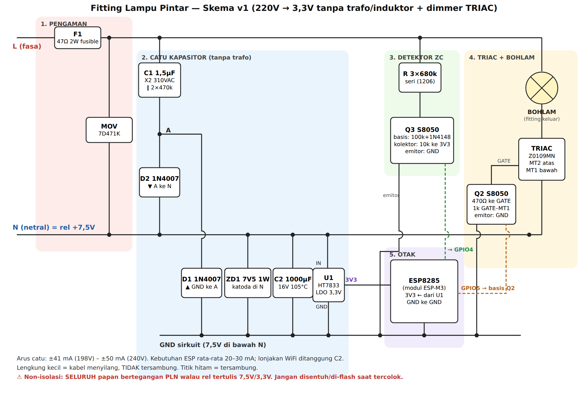

# Fitting Lampu Pintar — Rancangan Produk v1

Fitting sambungan E27 → E27 berisi ESP8285 + TRIAC. Pembeli tinggal memasang
fitting ini di antara fitting plafon dan bohlam yang sudah ada, lalu mengatur
lampu dari HP: nyala/mati, redup-terang, timer, jadwal, mode rumah berpenghuni.
Tanpa trafo, tanpa induktor.

> Status: **rancangan + firmware v1.0.0 (sudah lolos kompilasi & tes kurva)**.
> Belum ada prototipe fisik. Semua angka harga adalah **perkiraan pasar** yang
> wajib dicek ulang ke supplier sebelum produksi.

---

## 1. Posisi jual (kenapa orang mau beli)

| Pesaing | Kelemahan yang kita serang |
|---|---|
| Bohlam pintar Tuya/Xiaomi (Rp40–90rb) | Wajib akun + cloud luar negeri, mati kalau internet putus, harus ganti bohlam |
| Saklar pintar dinding (Rp60–150rb) | Harus bongkar saklar & instalasi, butuh tukang |
| Dimmer putar biasa (Rp25–40rb) | Tidak bisa dari HP, tidak ada jadwal |

Pesan jual utama (dipakai di judul & foto Shopee/Tokopedia):

1. **"Pasang 10 detik, tanpa tukang"** — putar masuk ke fitting, bohlam lama tetap dipakai.
2. **"Tanpa internet, tanpa akun, tanpa langganan"** — kontrol lewat WiFi rumah;
   kalau tidak ada router pun bisa konek langsung ke lampu.
3. **"Saklar tembok tetap berfungsi"** — mati/nyala saklar dinding = lampu
   ikut, perilaku bisa dipilih (kembali seperti terakhir / selalu terang / tetap mati).
4. **Jadwal & timer** — nyala otomatis magrib, mati jam 6 pagi; "bangun pelan"
   (terang bertahap 1–4 menit); timer tidur 15/30/60 menit.
5. **Mode rumah berpenghuni (anti-maling)** — saat mudik lampu nyala-mati acak 18:00–23:30.
6. **Peredup** untuk bohlam pijar / LED "dimmable" / bohlam filamen dekorasi kafe.

Jujur di deskripsi (mengurangi retur & bintang 1): **LED biasa (non-dimmable)
hanya bisa nyala/mati/jadwal, tidak bisa diredupkan.** Aplikasi punya pilihan
"Jenis bohlam" supaya LED biasa tidak dipaksa redup (kedip/cepat rusak).
Bundling dengan bohlam LED dimmable adalah upsell yang wajar.

## 2. Arsitektur listrik



Gambar: `docs/skema-v1.png` (sumber vektor `docs/skema-v1.svg`). Detail teks di bawah.

Rangkaian **non-isolasi**: seluruh PCB bertegangan jala-jala. Aman selama
tertutup penuh di casing — sama seperti mayoritas bohlam pintar komersial.

```
 L ──F1──┬──────────────── LAMPU (fitting keluar) ─── MT2 ┐
  47Ω 2W │                                               TRIAC Z0109MN (SOT-223)
fusible MOV 471                                          MT1 ┘
         │                                                   │
 N ──────┴───────────────────────────────────────────────────┴── = rail "+7V5"
         │
   [CATU KAPASITOR — setengah gelombang, rail negatif terhadap N]
   L(sesudah F1) ── C1 1,5µF X2 310VAC (‖ R 2×470k bleeder) ── A
   A ── D2 (1N4007, anoda A → katoda N)          ← setengah gelombang positif
   GND ── D1 (1N4007, anoda GND → katoda A)      ← mengisi C2 saat N > L
   N ─┬─ ZD1 7V5 1W (katoda di N) ─┬─ GND
      └─ C2 1000µF 16V 105°C ──────┘
   N(+7V5) → U1 HT7833 (IN)   GND → U1 (GND)   U1 OUT = 3V3 (terhadap GND)
            C3 10µF + 100nF di 3V3

   [DETEKSI ZERO-CROSS]
   L ── 3× 680k 1206 seri ──┬── basis Q3 S8050 ; emitor GND
                            ├── 100k ke GND ; 1N4148 (katoda basis) ke GND
   kolektor Q3 ── 10k ke 3V3 ── GPIO4 (berganti level tiap zero-cross)

   [PENGGERAK GATE]
   GPIO5 ── 1k ── basis Q2 S8050 (10k basis→GND) ; emitor GND
   kolektor Q2 ── 470Ω ── GATE TRIAC ; 1k GATE–MT1
   → arus gate mengalir dari N (MT1) ke GND = kuadran II/III, paling peka.
```

Kenapa susunan "N = rail atas, GND 7,5V di bawah netral": MT1 TRIAC harus
nyambung ke netral (jalur arus lampu), dan TRIAC paling andal dipicu arus gate
negatif. Dengan rangkaian di-referensikan begini, transistor cukup menarik gate
ke GND — tidak perlu optotriac (hemat ±Rp2.000 dan 15mA arus LED).

Kalau L dan N tertukar di instalasi rumah (sangat umum di Indonesia), alat tetap
berfungsi: semua bagian "ikut" kabel yang tersambung ke MT1.

### 2.1 Anggaran arus (yang paling menentukan desain tanpa trafo)

Arus rata-rata catu setengah gelombang: `I ≈ f · C1 · (2·Vpuncak − Vz)`

| Tegangan PLN | Arus tersedia |
|---|---|
| 198V (−10%) | 50 × 1,5µF × (560 − 8) ≈ **41 mA** |
| 220V | ≈ **46 mA** |
| 240V | ≈ **50 mA** (sisa dibuang zener ≈ 0,2W) |

Kebutuhan: ESP8285 modem-sleep tersambung WiFi ≈ 20–30 mA rata-rata, deteksi
ZC 0,3 mA, gate TRIAC 0,4 mA rata-rata. Puncak TX WiFi 170–250 mA selama
beberapa ms ditanggung C2: 1000µF turun dari 7,5V ke 3,6V menyimpan ±3,9 mC =
±15 ms pada 250 mA — jauh di atas durasi satu burst TX.

Firmware ikut membantu: daya pancar dipangkas ke 17 dBm, modem-sleep aktif,
tidak pakai light-sleep (light-sleep mematikan timer TRIAC).

Disipasi panas: F1 ≈ 0,5W (arus RMS C1 ≈ 104 mA), ZD1 ≤ 0,4W, TRIAC ≈ 0,6W pada
100W lampu. **Rating produk: maks 60W pijar / 40W LED dimmable** — fitting
tertutup di bawah bohlam pijar bisa >70°C; semua elco wajib 105°C long-life.

### 2.2 Pengaman

- F1 resistor *fusible flameproof* 47Ω 2W: membatasi arus lonjakan saat
  dinyalakan di puncak gelombang dan putus aman kalau C1 short.
- MOV 7D471K: lonjakan petir/induktif dari jaringan.
- C1 wajib kelas **X2** (gagal = terbuka, bukan short).
- Bleeder 2×470k: C1 terkosongkan saat fitting dicabut (tidak nyetrum di pin).
- Gate dilepas paksa di awal tiap setengah gelombang oleh firmware.
- Opsional (tambah ±Rp1.000): sekering termal 115°C di jalur L.

### 2.3 Pin ESP8285

| GPIO | Fungsi | Catatan |
|---|---|---|
| 4 | Input zero-cross | Tidak punya peran boot |
| 5 | Gate TRIAC (lewat Q2) | LOW saat boot → lampu tidak berkedip saat dinyalakan |
| 0/2/15 | Strap boot | Biarkan pull-up/pull-down standar modul |
| TX/RX | Pad flashing | Hanya untuk produksi, **tidak boleh** dihubungkan ke PC saat ada listrik 220V |

## 3. Daftar komponen & HPP (perkiraan grosir 1.000 pcs)

| Komponen | Rp/unit |
|---|---:|
| Modul ESP8285 (ESP-M3 / ESP-01M, flash 1MB internal) | 17.000 |
| C1 1,5µF X2 310VAC | 2.500 |
| F1 47Ω 2W fusible | 600 |
| MOV 7D471K | 500 |
| 2× 1N4007, ZD1 7V5 1W | 500 |
| C2 1000µF/16V 105°C | 1.500 |
| HT7833 + C3 | 1.300 |
| TRIAC Z0109MN | 1.800 |
| 2× S8050, 1N4148, resistor-resistor | 800 |
| Sekering termal 115°C | 1.000 |
| PCB bulat 2 layer | 2.000 |
| Casing fitting E27→E27 (PC/ABS V-0) | 6.000 |
| Dus + manual + stiker QR & PIN | 3.000 |
| Perakitan + flash + uji 220V | 4.000 |
| Cadangan reject/garansi 5% | 2.200 |
| **HPP per unit** | **±44.700** |

## 4. Harga jual & margin

| Skenario | Harga | Potongan marketplace + promo (±20%) | Bersih | Laba/unit | Margin |
|---|---:|---:|---:|---:|---:|
| Rekomendasi | **Rp79.000** | 15.800 | 63.200 | 18.500 | **23%** |
| Promo bawah | Rp69.000 | 13.800 | 55.200 | 10.500 | 15% |
| Paket 3 pcs | Rp219.000 | 43.800 | 175.200 | 41.100 | 19% |

Di bawah Rp100rb dan margin di atas 10% di semua skenario — **dengan catatan
biaya sertifikasi di §6 belum masuk**. Biaya itu harus dibagi ke jumlah unit:
misalnya Rp25 juta dibagi 1.000 unit = Rp25rb/unit (margin habis), dibagi 5.000
unit = Rp5rb/unit (margin rekomendasi turun ke ±17%). Jadi rencanakan batch
produksi yang cukup besar, atau jual awal sebagai B2B (kafe/kos/villa) dulu.

## 5. Firmware & aplikasi

Kode: `iot-fitting-dimmer/firmware/` (PlatformIO atau Arduino IDE, core ESP8266 3.1.x).

- **Kontrol fase TRIAC**: interrupt zero-cross (otomatis 50/60 Hz) + Timer1,
  pulsa gate 250µs. Kurva kecerahan dikoreksi daya dan mata (gamma 2) sehingga
  slider terasa rata. "Redup minimum" bisa diatur (0–60%) untuk LED dimmable
  yang kedip di level rendah.
- **Setup WiFi tanpa aplikasi**: lampu baru memancarkan WiFi `Lampu-XXXXXX`,
  HP yang konek otomatis diarahkan ke halaman setup (captive portal).
- **Tetap jalan tanpa router**: kalau WiFi rumah gagal 30 detik, lampu membuka
  WiFi-nya sendiri 10 menit untuk kontrol langsung/ganti WiFi.
- **Reset tanpa tombol**: nyala-mati saklar tembok 5× cepat → WiFi terhapus,
  lampu kedip 3× sebagai tanda.
- **Jadwal** (8 slot, per hari, dengan transisi s.d. 255 detik), **timer tidur**,
  **mode rumah berpenghuni** — jam dari NTP zona WIB.
- **Ingat kondisi terakhir** di flash (ditulis tertunda 5 detik, hanya bila berubah).
- **Update firmware OTA** lewat `http://<ip>/update` (user `admin`, PIN 6 digit
  unik per chip → dicetak di stiker kemasan saat produksi; PIN tampil di log
  serial saat flashing).
- **Discovery** untuk aplikasi: mDNS `lampu-xxxxxx.local` + layanan
  `_leker-lampu._tcp`, dan balasan UDP port 4210 untuk pesan `LEKER_LAMPU?`.
- **API JSON lokal** (dipakai halaman web & aplikasi):

| Method | Path | Parameter |
|---|---|---|
| GET | `/api/state` | — |
| POST | `/api/set` | `on=0/1`, `level=0..100`, `fade=ms` |
| POST | `/api/toggle` | `fade` |
| POST | `/api/timer` | `minutes=0..720` |
| POST | `/api/away` | `on=0/1` |
| POST | `/api/config` | `name`, `lampType=dimmable/onoff`, `minLevel`, `powerOn=0/1/2` |
| GET/POST | `/api/schedules` | JSON `{"schedules":[{enabled,days,hour,minute,level,fadeSec}]}` |
| GET | `/api/scan` | — |
| POST | `/api/wifi` | `ssid`, `pass` |
| POST | `/api/reset` | `confirm=RESET` |

Aplikasi Play Store (tahap berikut, butuh Android Studio di komputer):
pembungkus WebView yang memakai halaman yang sama dari lampu, plus layar daftar
lampu (discovery UDP/mDNS), grup "semua lampu", dan widget layar depan. Satu UI
untuk browser dan aplikasi → tidak ada dua versi yang bisa berbeda perilaku.

Kontrol dari luar rumah (lewat internet) **sengaja belum** di v1: butuh server
relay + akun, menambah biaya bulanan dan menghapus pesan jual "tanpa cloud".
Bisa jadi varian "Pro" kemudian.

## 6. Risiko & syarat sebelum jualan

1. **Sertifikasi perangkat WiFi (SDPPI/Komdigi)** — perangkat yang memancarkan
   WiFi dan dijual di Indonesia wajib bersertifikat; marketplace makin ketat
   meminta nomor sertifikat. Modul bersertifikat membantu, tetapi produk jadi
   umumnya tetap perlu diuji. Cek juga apakah fitting/perlengkapan listrik ini
   masuk **SNI wajib**. Biaya & waktunya harus ditanyakan ke lab uji sebelum
   menetapkan harga final.
2. **Non-isolasi** — tidak boleh ada port/tombol logam terbuka. Flashing hanya
   di jig produksi **tanpa** 220V.
3. **Panas** di bawah bohlam pijar besar — batasi rating, pakai komponen 105°C.
4. **Flicker kecil** saat WiFi sedang sibuk (interrupt tertunda puluhan µs) —
   umum di dimmer ESP8266; terlihat di level sangat redup saja.
5. **LED non-dimmable** — mode on/off sudah disediakan; deskripsi produk wajib jelas.

## 7. Langkah berikutnya

1. Bos Cyo menyetujui rancangan ini (atau minta revisi).
2. Hana menyiapkan **handoff untuk Claude di komputer**: gambar PCB (KiCad),
   uji prototipe dengan isolation transformer + oskiloskop, kalibrasi
   konstanta zero-cross, dan aplikasi Android.
3. Pesan 10 PCB prototipe + komponen, uji 7 hari nonstop dengan 3 jenis
   bohlam (pijar 40W, LED dimmable 9W, filamen 4W).

## DOC-IMPACT

Dokumen ini adalah sumber kebenaran rancangan fitting lampu pintar. Ubah di sini
bila skema, pin, anggaran arus, API firmware, atau hitungan harga berubah, dan
sesuaikan `firmware/` bersamaan. Proyek ini terpisah dari aplikasi POS Leker —
tidak menyentuh Worker, D1, maupun migration.
