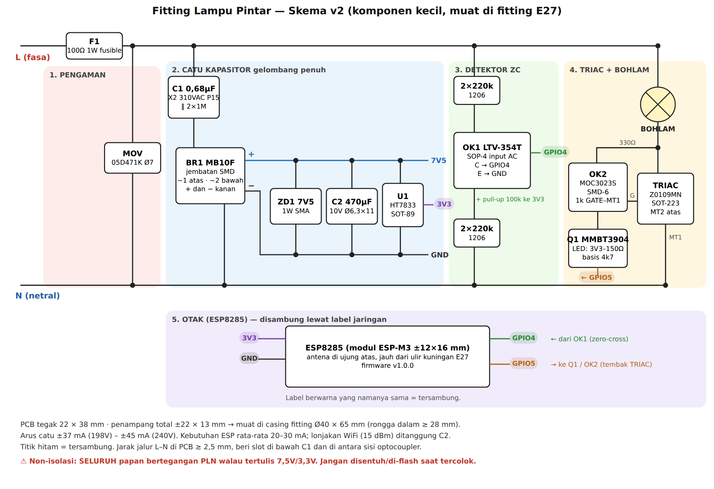

# Fitting Lampu Pintar — Rancangan Produk v1

Fitting sambungan E27 → E27 berisi ESP8285 + TRIAC. Pembeli tinggal memasang
fitting ini di antara fitting plafon dan bohlam yang sudah ada, lalu mengatur
lampu dari HP: nyala/mati, redup-terang, timer, jadwal, mode rumah berpenghuni.
Tanpa trafo, tanpa induktor.

> Status: **rancangan v2 (komponen kecil) + firmware v1.0.0 (lolos kompilasi & tes kurva)**.
> Belum ada prototipe fisik. Semua angka harga adalah **perkiraan pasar** yang
> wajib dicek ulang ke supplier sebelum produksi.

---

## 1. Posisi jual (kenapa orang mau beli)

| Pesaing | Kelemahan yang kita serang |
|---|---|
| Bohlam pintar Tuya/Xiaomi (Rp40–90rb) | Wajib akun + cloud luar negeri, mati kalau internet putus, harus ganti bohlam |
| Saklar pintar dinding (Rp60–150rb) | Harus bongkar saklar & instalasi, butuh tukang |
| Dimmer putar biasa (Rp25–40rb) | Tidak bisa dari HP, tidak ada jadwal |

Pesan jual utama (dipakai di judul & foto Shopee/Tokopedia):

1. **"Pasang 10 detik, tanpa tukang"** — putar masuk ke fitting, bohlam lama tetap dipakai.
2. **"Tanpa internet, tanpa akun, tanpa langganan"** — kontrol lewat WiFi rumah;
   kalau tidak ada router pun bisa konek langsung ke lampu.
3. **"Saklar tembok tetap berfungsi"** — mati/nyala saklar dinding = lampu
   ikut, perilaku bisa dipilih (kembali seperti terakhir / selalu terang / tetap mati).
4. **Jadwal & timer** — nyala otomatis magrib, mati jam 6 pagi; "bangun pelan"
   (terang bertahap 1–4 menit); timer tidur 15/30/60 menit.
5. **Mode rumah berpenghuni (anti-maling)** — saat mudik lampu nyala-mati acak 18:00–23:30.
6. **Peredup** untuk bohlam pijar / LED "dimmable" / bohlam filamen dekorasi kafe.

Jujur di deskripsi (mengurangi retur & bintang 1): **LED biasa (non-dimmable)
hanya bisa nyala/mati/jadwal, tidak bisa diredupkan.** Aplikasi punya pilihan
"Jenis bohlam" supaya LED biasa tidak dipaksa redup (kedip/cepat rusak).
Bundling dengan bohlam LED dimmable adalah upsell yang wajar.

## 2. Arsitektur listrik (v2 — dimensi kecil, muat di fitting)



Gambar: `docs/skema-v2.png` (sumber vektor `docs/skema-v2.svg`). Detail teks di bawah.

**Perubahan dari v1:** di v1 kapasitor X2 berukuran 1,5µF (±26×11×20 mm) dan elconya
1000µF (Ø10×16 mm), terlalu besar untuk fitting. Penyebabnya penyearah setengah
gelombang yang cuma memakai separuh gelombang listrik. v2 memakai **penyearah
gelombang penuh** (dioda jembatan SMD), jadi kapasitornya cukup **0,68µF**
untuk arus yang sama. Konsekuensinya, rangkaian tidak lagi "menempel" ke
netral, sehingga TRIAC dan detektor zero-cross dihubungkan lewat **dua
optocoupler kecil**. Tambahan biayanya ±Rp2.800, dan alat jadi lebih kebal
noise.

Rangkaian tetap **non-isolasi**: seluruh PCB bertegangan jala-jala. Aman selama
tertutup penuh di casing, sama seperti mayoritas bohlam pintar komersial.

```
 L ──F1──┬──────────────────────── BOHLAM (fitting keluar) ── MT2 ┐
 100Ω 1W │                                                TRIAC Z0109MN (SOT-223)
fusible MOV 05D471K                                           MT1 ┘
         │                                                        │
 N ──────┴────────────────────────────────────────────────────────┘

 [CATU KAPASITOR — gelombang penuh]
   L(sesudah F1) ── C1 0,68µF X2 310VAC (‖ 2×1M 1206 bleeder) ── BR1 ~1
   N ────────────────────────────────────────────────────────────── BR1 ~2
   BR1 = MB10F (jembatan SMD).  BR1 + = rel 7V5,  BR1 − = GND
   7V5 ─┬─ ZD1 7V5 1W SMA (katoda di 7V5) ─┬─ GND
        └─ C2 470µF 10V 105°C ─────────────┘
   7V5 → U1 HT7833 → 3V3 (C3 10µF + 100nF dekat ESP)

 [DETEKSI ZERO-CROSS — optocoupler input AC]
   L ── 2×220k 1206 ── OK1 LTV-354T (SOP-4, LED bolak-balik) ── 2×220k 1206 ── N
   OK1 transistor: kolektor ── GPIO4 (pull-up 100k ke 3V3), emitor GND
   → GPIO4 LOW sepanjang gelombang, naik HIGH sesaat di setiap zero-cross

 [PENGGERAK TRIAC — optotriac]
   GPIO5 ── 4k7 ── basis Q1 MMBT3904 (SOT-23), emitor GND
   3V3 ── 150Ω ── LED OK2 MOC3023S ── kolektor Q1        (±10 mA, 250µs/tembak)
   OK2 sisi triac: MT2 ── 330Ω ── OK2 ── GATE TRIAC ; 1k GATE–MT1
```

Kalau L dan N tertukar di instalasi rumah (sangat umum di Indonesia), alat tetap
berfungsi karena jembatan dioda dan kedua optocoupler tidak peduli polaritas.

### 2.1 Anggaran arus

Arus rata-rata catu gelombang penuh: `I ≈ 4 · f · C1 · (Vpuncak − Vz − 1,4)`

| Tegangan PLN | Arus tersedia (C1 = 0,68µF) |
|---|---|
| 198V (−10%) | 200 × 0,68µF × (280 − 9) ≈ **37 mA** |
| 220V | ≈ **41 mA** |
| 240V | ≈ **45 mA** (sisa dibuang zener ≤ 0,25W) |

Kebutuhan:
- ESP8285 dalam modem-sleep sambil tersambung WiFi: ±20–30 mA rata-rata.
- LED optotriac: ±0,3 mA rata-rata.
- Detektor zero-cross: ±0,03 mA, diambil dari sisi 3V3.

Lonjakan arus saat WiFi memancar (±170 mA pada daya 15 dBm) ditanggung C2.
470µF yang turun dari 7,5V ke 3,6V menyimpan ±1,8 mC, cukup untuk ±10 ms.
Satu burst TX cuma beberapa ms.

Firmware ikut menjaga anggaran ini:
- Daya pancar dipangkas ke **15 dBm**. Jangkauan sedikit turun tapi masih cukup
  untuk satu rumah.
- Modem-sleep aktif.
- Light-sleep tidak dipakai, karena light-sleep mematikan timer TRIAC.

Disipasi panas:
- F1 ≈ 0,22W (arus RMS C1 ≈ 47 mA).
- ZD1 ≤ 0,25W.
- TRIAC ≈ 0,4W pada beban 60W.

**Rating produk: maks 60W pijar / 40W LED dimmable.** Fitting tertutup di
bawah bohlam pijar bisa >70°C, jadi elco wajib 105°C long-life.

### 2.2 Ukuran komponen besar & tata letak di fitting

| Komponen | v1 | **v2** |
|---|---|---|
| Kapasitor penurun X2 | 1,5µF P22,5: ±26 × 11 × 20 mm | **0,68µF P15: ±18 × 8,5 × 14,5 mm** |
| Elco tandon | 1000µF 16V: Ø10 × 16 mm | **470µF 10V: Ø6,3 × 11 mm** (dibaringkan) |
| Resistor sekering | 47Ω 2W: Ø5 × 15 mm | **100Ω 1W: Ø3,5 × 9 mm** |
| MOV | 7D471K: Ø9 mm | **05D471K: Ø7 mm** |
| Dioda | 2× 1N4007 (THT) | **MB10F SMD 4,7 × 4 mm** |
| Zener | 1W THT | **SMA 4,3 × 2,6 mm** |
| Penggerak TRIAC | S8050 + resistor | **MOC3023S (SMD-6 ±9 × 6,5 mm) + MMBT3904** |
| Detektor ZC | S8050 + 3 resistor 680k | **LTV-354T SOP-4 4,4 × 3,6 mm** |
| ESP | modul ESP8285 (ESP-M3) ±12 × 16 mm | sama |

Ukuran di atas adalah ukuran khas datasheet. Wajib dicek ulang ke merek yang
benar-benar dibeli, karena ukuran kapasitor X2 berbeda antar merek ±2 mm.

**Tata letak yang diusulkan:**
- **Satu PCB tegak 22 × 38 mm, tebal 1 mm**, berdiri searah sumbu fitting.
- **Sisi A (komponen besar):** C1, C2, F1, MOV, TRIAC. Total tebal ±10 mm.
- **Sisi B (komponen kecil):** semua SMD, plus modul ESP di ujung atas. Antena
  harus berada di ujung yang jauh dari ulir kuningan E27, karena logam meredam
  WiFi.
- **Penampang total:** ±22 × 13 mm, diagonal ±26 mm. Jadi muat di rongga
  casing berdiameter dalam ≥ 28 mm.
- **Casing fitting sambungan E27** umumnya Ø38–42 mm (rongga dalam ±32–35 mm).
  Usulan dimensi luar produk: **±Ø40 × 65 mm** (termasuk ulir E27).
- **Jarak aman di PCB:** jalur L dan N berjarak ≥ 2,5 mm. Buat celah potong (slot)
  di bawah C1 dan di antara dua sisi optocoupler.

Kalau masih kurang kecil, langkah berikutnya: chip ESP8285 dipasang langsung di
PCB (tanpa modul) dengan antena jalur PCB. Ukuran PCB bisa turun ke ±18 × 30
mm, tapi desain RF-nya harus diuji ulang dan sertifikasinya melekat ke desain
itu.

### 2.3 Pengaman

- F1 resistor *fusible flameproof* 100Ω 1W: membatasi arus lonjakan saat
  dinyalakan tepat di puncak gelombang (maks ±3A sesaat) dan putus aman kalau
  C1 short.
- MOV 05D471K: lonjakan petir/induktif dari jaringan.
- C1 wajib kelas **X2** (gagal = terbuka, bukan short).
- Bleeder 2×1M: C1 terkosongkan saat fitting dicabut (pin tidak nyetrum).
- Gate dilepas paksa di awal tiap setengah gelombang oleh firmware.
- Opsional (tambah ±Rp1.000 dan Ø4 × 11 mm): sekering termal 115°C di jalur L.

### 2.4 Pin ESP8285

| GPIO | Fungsi | Catatan |
|---|---|---|
| 4 | Input zero-cross (dari LTV-354T) | Tidak punya peran boot; pull-up internal + 100k |
| 5 | LED optotriac (lewat Q1) | LOW saat boot → lampu tidak berkedip saat dinyalakan |
| 0/2/15 | Strap boot | Biarkan pull-up/pull-down standar modul |
| TX/RX | Pad flashing | Hanya untuk produksi, **tidak boleh** dihubungkan ke PC saat ada listrik 220V |

## 3. Daftar komponen & HPP (perkiraan grosir 1.000 pcs)

| Komponen | Rp/unit |
|---|---:|
| Modul ESP8285 (ESP-M3, flash 1MB internal) | 17.000 |
| C1 0,68µF X2 310VAC P15 | 1.800 |
| F1 100Ω 1W fusible | 400 |
| MOV 05D471K | 400 |
| BR1 MB10F + ZD1 7V5 SMA | 600 |
| C2 470µF/10V 105°C | 900 |
| HT7833 + C3 | 1.300 |
| TRIAC Z0109MN | 1.800 |
| Optotriac MOC3023S | 1.800 |
| Optocoupler LTV-354T | 1.000 |
| MMBT3904, resistor SMD | 600 |
| Sekering termal 115°C (opsional) | 1.000 |
| PCB 22×38 mm 2 layer | 1.500 |
| Casing fitting E27→E27 (PC/ABS V-0) | 6.000 |
| Dus + manual + stiker QR & PIN | 3.000 |
| Perakitan + flash + uji 220V | 4.000 |
| Cadangan reject/garansi 5% | 2.200 |
| **HPP per unit** | **±45.400** |

## 4. Harga jual & margin

| Skenario | Harga | Potongan marketplace + promo (±20%) | Bersih | Laba/unit | Margin |
|---|---:|---:|---:|---:|---:|
| Rekomendasi | **Rp79.000** | 15.800 | 63.200 | 17.800 | **22%** |
| Promo bawah | Rp69.000 | 13.800 | 55.200 | 9.800 | 14% |
| Paket 3 pcs | Rp219.000 | 43.800 | 175.200 | 39.000 | 18% |

Semua skenario di bawah Rp100rb dengan margin di atas 10%, **tapi biaya
sertifikasi di §6 belum masuk**. Biaya itu harus dibagi ke jumlah unit:
- Rp25 juta dibagi 1.000 unit = Rp25rb/unit, margin habis.
- Dibagi 5.000 unit = Rp5rb/unit, margin harga rekomendasi turun ke ±16%.

Jadi rencanakan batch produksi yang cukup besar, atau mulai jualan B2B
(kafe/kos/villa) dulu.

## 5. Firmware & aplikasi

Kode: `iot-fitting-dimmer/firmware/` (PlatformIO atau Arduino IDE, core ESP8266 3.1.x).

- **Kontrol fase TRIAC**: interrupt zero-cross (otomatis 50/60 Hz) + Timer1,
  pulsa LED optotriac 250µs. Titik nol sejati dihitung dari tengah pulsa
  optocoupler, jadi tidak perlu kalibrasi per unit. Kurva kecerahan dikoreksi daya dan mata (gamma 2) sehingga
  slider terasa rata. "Redup minimum" bisa diatur (0–60%) untuk LED dimmable
  yang kedip di level rendah.
- **Setup WiFi tanpa aplikasi**: lampu baru memancarkan WiFi `Lampu-XXXXXX`,
  HP yang konek otomatis diarahkan ke halaman setup (captive portal).
- **Tetap jalan tanpa router**: kalau WiFi rumah gagal 30 detik, lampu membuka
  WiFi-nya sendiri 10 menit untuk kontrol langsung/ganti WiFi.
- **Reset tanpa tombol**: nyala-mati saklar tembok 5× cepat → WiFi terhapus,
  lampu kedip 3× sebagai tanda.
- **Jadwal** (8 slot, per hari, dengan transisi s.d. 255 detik), **timer tidur**,
  **mode rumah berpenghuni** — jam dari NTP zona WIB.
- **Ingat kondisi terakhir** di flash (ditulis tertunda 5 detik, hanya bila berubah).
- **Update firmware OTA** lewat `http://<ip>/update` (user `admin`, PIN 6 digit
  unik per chip → dicetak di stiker kemasan saat produksi; PIN tampil di log
  serial saat flashing).
- **Discovery** untuk aplikasi: mDNS `lampu-xxxxxx.local` + layanan
  `_leker-lampu._tcp`, dan balasan UDP port 4210 untuk pesan `LEKER_LAMPU?`.
- **API JSON lokal** (dipakai halaman web & aplikasi):

| Method | Path | Parameter |
|---|---|---|
| GET | `/api/state` | — |
| POST | `/api/set` | `on=0/1`, `level=0..100`, `fade=ms` |
| POST | `/api/toggle` | `fade` |
| POST | `/api/timer` | `minutes=0..720` |
| POST | `/api/away` | `on=0/1` |
| POST | `/api/config` | `name`, `lampType=dimmable/onoff`, `minLevel`, `powerOn=0/1/2` |
| GET/POST | `/api/schedules` | JSON `{"schedules":[{enabled,days,hour,minute,level,fadeSec}]}` |
| GET | `/api/scan` | — |
| POST | `/api/wifi` | `ssid`, `pass` |
| POST | `/api/reset` | `confirm=RESET` |

Aplikasi Play Store (tahap berikut, butuh Android Studio di komputer):
pembungkus WebView yang memakai halaman yang sama dari lampu, plus layar daftar
lampu (discovery UDP/mDNS), grup "semua lampu", dan widget layar depan. Satu UI
untuk browser dan aplikasi → tidak ada dua versi yang bisa berbeda perilaku.

Kontrol dari luar rumah (lewat internet) **sengaja belum** di v1: butuh server
relay + akun, menambah biaya bulanan dan menghapus pesan jual "tanpa cloud".
Bisa jadi varian "Pro" kemudian.

## 6. Risiko & syarat sebelum jualan

1. **Sertifikasi perangkat WiFi (SDPPI/Komdigi)** — perangkat yang memancarkan
   WiFi dan dijual di Indonesia wajib bersertifikat; marketplace makin ketat
   meminta nomor sertifikat. Modul bersertifikat membantu, tetapi produk jadi
   umumnya tetap perlu diuji. Cek juga apakah fitting/perlengkapan listrik ini
   masuk **SNI wajib**. Biaya & waktunya harus ditanyakan ke lab uji sebelum
   menetapkan harga final.
2. **Non-isolasi** — tidak boleh ada port/tombol logam terbuka. Flashing hanya
   di jig produksi **tanpa** 220V.
3. **Panas** di bawah bohlam pijar besar — batasi rating, pakai komponen 105°C.
4. **Flicker kecil** saat WiFi sedang sibuk (interrupt tertunda puluhan µs) —
   umum di dimmer ESP8266; terlihat di level sangat redup saja.
5. **LED non-dimmable** — mode on/off sudah disediakan; deskripsi produk wajib jelas.

## 7. Langkah berikutnya

1. Bos Cyo menyetujui rancangan ini (atau minta revisi).
2. Hana menyiapkan **handoff untuk Claude di komputer**: gambar PCB (KiCad),
   uji prototipe dengan isolation transformer + oskiloskop, kalibrasi
   konstanta zero-cross, dan aplikasi Android.
3. Pesan 10 PCB prototipe + komponen, uji 7 hari nonstop dengan 3 jenis
   bohlam (pijar 40W, LED dimmable 9W, filamen 4W).

## DOC-IMPACT

Dokumen ini adalah sumber kebenaran rancangan fitting lampu pintar. Ubah di sini
bila skema, pin, anggaran arus, API firmware, atau hitungan harga berubah, dan
sesuaikan `firmware/` bersamaan. Proyek ini terpisah dari aplikasi POS Leker —
tidak menyentuh Worker, D1, maupun migration.
